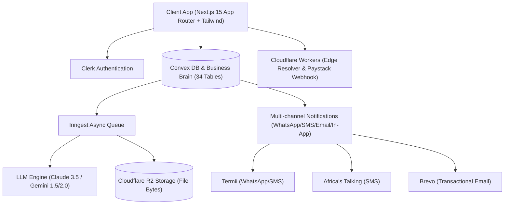

# 🇳🇬 AI Business Passport — Nigeria's AI-Powered Business Operating System

> **"Tell us about your business once; stay registered, compliant, tender-ready, and present a verifiable digital identity always."**

**AI Business Passport** is an enterprise-grade operating system designed specifically for Nigerian SMEs, startups, contractors, artisans, and professional service providers. It unifies deterministic compliance (CAC, FIRS, LIRS, PenCom, SCUML, ITF, NSITF), document intelligence, automated tender readiness, multi-channel notifications, print-ready peripherals, live invoices, and a verifiable public identity credential into a single unified platform.

---

## 📌 Executive Table of Contents
1. [Key Features & Capabilities](#-key-features--capabilities)
2. [System Architecture & Stack](#-system-architecture--stack)
3. [Implemented Segments Summary](#-implemented-segments-summary)
4. [Live Studio & Peripherals Gallery](#-live-studio--peripherals-gallery)
5. [Getting Started & Local Setup](#-getting-started--local-setup)
6. [Testing & Quality Verification](#-testing--quality-verification)
7. [Security & NDPA 2023 Compliance](#-security--ndpa-2023-compliance)
8. [Production Deployment Guide](#-production-deployment-guide)
9. [What's Left & Roadmap](#-whats-left--roadmap)

---

## 🚀 Key Features & Capabilities

- 🎴 **Verifiable Business Passport & 3D ID Cards**: Drivers license style interactive card with 3D flip (Front & Back), official CAC/FIRS QR code seal, vCard 3.0 export, and NFC support.
- 📄 **Print-Ready Peripherals Studio**: Auto-generates branded Corporate Letterheads, DL Envelopes, Staff Uniform T-Shirts, Office Desk Display Plaques, Tax Invoices, and A4 Credentials Certificates.
- 🧾 **Live Realtime Invoice, Proforma & Quotation Studio**: Dynamic inline table editor with line items, quantity, unit rates, 7.5% FIRS VAT calculation, discount rates, currency switcher (₦, $, €, £), and direct printing.
- 🏢 **One-Off Business Services & Filings Marketplace**: Catalogue for CAC Business Name & LLC Registration, Annual Returns, TCC, PenCom, ITF, and SCUML filing orders with fixed NGN prices.
- 👨‍💼 **Professional Partner Network**: Verified directory and onboarding portal for Lawyers, Chartered Accountants (ICAN/ANAN), and CAC Accredited Agents to receive sublet tasks or direct client leads.
- 🇳🇬 **Deterministic Compliance Engine**: Explicit rules engine evaluating statutory deadlines for CAC, FIRS (CIT/VAT/WHT), PenCom, SCUML, ITF, and NSITF without LLM decision latency.
- 📁 **Business Vault Intelligence**: Secure Cloudflare R2 object storage with automated OCR extraction, expiry tracking, confidence scoring, and advisor category grants.
- 🎯 **Tender Readiness Assistant**: PDF tender document chunking, mandatory disqualification checks, requirement extraction, and pre-submission audit modal.
- 🤖 **Business AI Assistant**: 3-mode streaming assistant (*Simple Answer*, *Walkthrough*, *Hand-off*) with Web Speech voice input and 10 server-side tools.
- 👑 **Super Admin Control Center**: Granular RBAC, 34-table database access, rules editor with two-person publication rule, and real-time revenue analytics.

---

## 🏗️ System Architecture & Stack



- **Frontend**: Next.js 15 App Router, React 19, TypeScript (Strict), Tailwind CSS, shadcn/ui.
- **Backend & Database**: Convex (Single source of truth, 34 tables, real-time subscriptions).
- **Authentication**: Clerk (RBAC: `owner`, `staff`, `advisor`, `admin`, `content_editor`).
- **Async Pipeline**: Inngest (Document OCR, background generation, dunning, sync jobs).
- **File Storage**: Cloudflare R2 (Byte storage; Convex holds metadata & object keys only).
- **Payments**: Paystack (Primary HMAC Webhook worker), Nomba (Secondary).
- **Edge Layer**: Cloudflare Workers (`/workers/passport-resolver` & `/workers/paystack-webhook`).

---

## 📑 Implemented Segments Summary

| Segment | Module | Status | Highlights |
| :--- | :--- | :---: | :--- |
| **Segment 1–3** | Architecture, Database & Auth | 🟢 Complete | 34-table Convex schema, Clerk webhook sync, strict RBAC |
| **Segment 4** | Provider-Agnostic LLM Engine | 🟢 Complete | Claude 3.5 & Gemini adapters with eval harness |
| **Segment 5** | Mobile Onboarding & Brain | 🟢 Complete | Step-by-step chat onboarding & Business Brain snapshot |
| **Segment 6** | Business Vault Intelligence | 🟢 Complete | Cloudflare R2 storage, OCR extraction, expiry alerts |
| **Segment 7** | Compliance Rules Engine | 🟢 Complete | Deterministic DSL engine for CAC, FIRS, PenCom, SCUML |
| **Segment 8** | Verifiable Passport UI & Admin | 🟢 Complete | Passport card preview, admin rules editor, audit log |
| **Segment 9** | Public Passport Edge Resolver | 🟢 Complete | Cloudflare Worker edge resolver, vCard 3.0, QR & NFC |
| **Segment 10**| Networking & Document Sharing | 🟢 Complete | OTP verification, 10-download limit, gap disclosure |
| **Segment 11**| Money, Entitlements & Paystack | 🟢 Complete | `/lib/entitlements.ts` single source of truth, Paystack HMAC |
| **Segment 12**| Multi-Channel Notifications | 🟢 Complete | WhatsApp, SMS (Termii/Africa's Talking), Email cascade |
| **Segment 13**| Document Studio | 🟢 Complete | 14 starting templates + 6 industry packs, grounding checks |
| **Segment 14**| Tender Assistant | 🟢 Complete | PDF parsing, requirement extraction, pre-submission audit |
| **Segment 15**| Business AI Assistant | 🟢 Complete | Streaming chat, Web Speech voice input, 10 server tools |
| **Segment 16**| Transactional Revenue | 🟢 Complete | Print marketplace, professional referrals, Done-for-Me |
| **Segment 17**| Public Site & Delivery Quality | 🟢 Complete | Layman marketing site, PWA manifest, low-bandwidth, i18n |
| **Segment 18**| Hardening & Security Pass | 🟢 Complete | `/docs/SECURITY.md`, NDPA 2023, AES-256-GCM encryption |
| **Segment 19**| Pilot Verification & Launch | 🟢 Complete | Playwright E2E suite, PostHog feature flags, eval gates |

---

## 🎨 Live Studio & Peripherals Gallery

Access all live interactive tools directly from your browser:

1. **Dashboard & Super Admin Control Center**: [`http://localhost:3000/dashboard`](http://localhost:3000/dashboard)
2. **Live Invoice, Proforma & Quotation Studio**: [`http://localhost:3000/invoice`](http://localhost:3000/invoice)
3. **One-Off Business Filings Marketplace**: [`http://localhost:3000/services`](http://localhost:3000/services)
4. **Professional Partner Directory & Portal**: [`http://localhost:3000/professionals`](http://localhost:3000/professionals)
5. **Printable Business Peripherals & 3D ID Cards**: [`http://localhost:3000/passport/print`](http://localhost:3000/passport/print)
6. **Automatic Corporate Company Profile Generator**: [`http://localhost:3000/profile/print`](http://localhost:3000/profile/print)
7. **Public Passport Credential Resolver**: [`http://localhost:3000/p/BP-NG-77A91B`](http://localhost:3000/p/BP-NG-77A91B)

---

## 💻 Getting Started & Local Setup

### 1. Environment Setup
Clone the repository and copy the environment template:
```bash
git clone https://github.com/Pasturjay/ai-business-passport.git
cd ai-business-passport
npm install
```

Ensure `.env.local` contains valid credentials:
```env
NEXT_PUBLIC_CONVEX_URL="http://127.0.0.1:3210"
NEXT_PUBLIC_CLERK_PUBLISHABLE_KEY="pk_test_..."
CLERK_SECRET_KEY="sk_test_..."
PAYSTACK_SECRET_KEY="sk_test_..."
```

### 2. Running Local Development Servers

```bash
# Terminal 1: Start Convex Local Backend
npx convex dev

# Terminal 2: Start Next.js App Router Server
npm run dev
```

Visit **`http://localhost:3000`** in your browser.

---

## 🧪 Testing & Quality Verification

Run the full verification suite to assert system integrity:

```bash
# 1. Run full 116 Vitest unit & integration tests
npx vitest run

# 2. Run LLM evaluation & OCR calibration harness
npm run eval

# 3. Audit Convex functions for strict RBAC authentication
npx tsx scripts/audit-convex-access.ts

# 4. Strict TypeScript type check
npx tsc --noEmit

# 5. Next.js linter check
npm run lint
```

---

## 🛡️ Security & NDPA 2023 Compliance

- **Data Privacy**: Field-level AES-256-GCM encryption for sensitive fields (NIN, TIN, financials).
- **Access Audit**: 100% of Convex functions enforce RBAC auth checks (85 protected, 6 whitelisted public).
- **NDPA 2023 Specification**: See [/docs/SECURITY.md](file:///c:/Users/FECUND%20INTEGRATED/Desktop/AI%20Business%20Passport/docs/SECURITY.md) for full Nigerian Data Protection Act compliance details.

---

## 🚢 Production Deployment Guide

1. **Next.js App**: Deploy to Vercel connected to the `master` branch.
2. **Cloudflare Workers**: Deploy workers in `/workers/passport-resolver` and `/workers/paystack-webhook` using `wrangler deploy`.
3. **Convex Backend**: Deploy Convex production schema using `npx convex deploy`.

---

## 📋 What's Left & Future Roadmap

- 📱 **Native Mobile PWA Packaging**: Capacitor wrapper for Google Play Store & Apple App Store submission.
- 💳 **Nomba Direct Card Terminal Integration**: In-person point-of-sale card payment processing for print partners.
- 🇳🇬 **CAC Direct API Integration**: Real-time CAC registry status check API when official public CAC endpoints open.

---

*AI Business Passport © 2026. Built with pride for Nigerian Business Success.*
