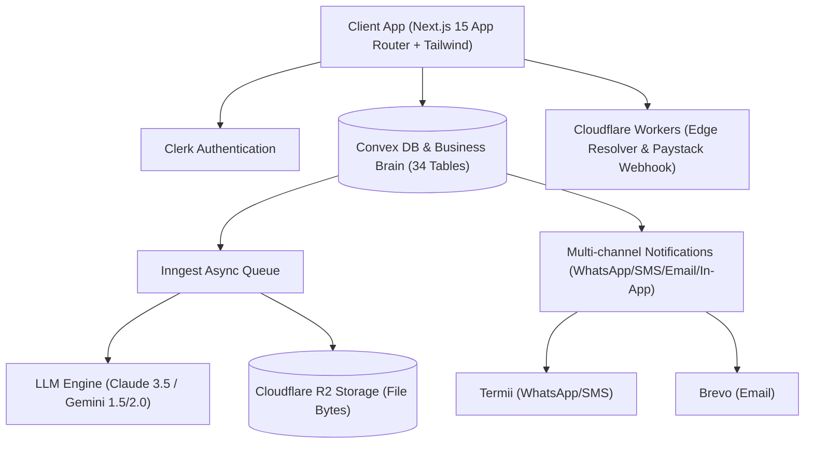

# 🇳🇬 Modus — Nigeria's Intelligent Business Operating System

> **"Run your Nigerian business on Modus; stay registered, compliant, tender-ready, and present a verifiable digital identity always."**

**Modus** ([modus.ng](https://modus.ng)) is an enterprise-grade operating system designed specifically for Nigerian SMEs, startups, contractors, artisans, and professional service providers. It unifies deterministic compliance (CAC, FIRS, LIRS, PenCom, SCUML, ITF, NSITF), document intelligence, automated tender readiness, multi-channel notifications, print-ready peripherals, live invoices, and a verifiable public identity credential into a single unified platform.

---

## 📌 Executive Table of Contents
1. [Domain Extension Architecture](#-domain-extension-architecture)
2. [Key Features & Capabilities](#-key-features--capabilities)
3. [System Architecture & Stack](#-system-architecture--stack)
4. [Role-Segmented Onboarding Flows](#-role-segmented-onboarding-flows)
5. [Live Studio & Peripherals Gallery](#-live-studio--peripherals-gallery)
6. [Getting Started & Local Setup](#-getting-started--local-setup)
7. [Testing, Security & Quality Verification](#-testing-security--quality-verification)
8. [Production Deployment Guide](#-production-deployment-guide)

---

## 🌐 Domain Extension Architecture

Modus features a clean, multi-tenant extension routing architecture designed for high responsiveness, SEO optimization, and strict role separation:

- **`app.modus.ng`** — **Business Owner App & Passport Studio**
  - For Founders & SMEs to manage registration, Vault documents, live invoices, 3D passport cards, and compliance calendars.
- **`partners.modus.ng`** — **Accredited Partner Network**
  - For Lawyers (NBA SAN), Chartered Accountants (ICAN/ANAN), CAC Agents, and Tax Practitioners to receive sublet tasks, handle client orders, and earn payouts.
- **`admin.modus.ng`** — **Operations Control Panel**
  - For Platform Admins & Staff to monitor system metrics, financial take-rate summaries, partner escrow queues, and compliance rules.
- **`modus.ng`** — **Marketing Portal & Master Onboarding Hub**
  - Central entry point with sharp SEO metadata, JSON-LD schema, and role selection hub.

---

## 🚀 Key Features & Capabilities

- 🎴 **Verifiable 3D Business Passport & Driver's License ID Cards**: Interactive card with 3D flip (Front & Back), official CAC/FIRS QR code seal, holder contact info, and magnetic security watermark.
- 📄 **Print-Ready Peripherals Studio**: Auto-generates branded Corporate Letterheads, DL Envelopes, Staff Uniform T-Shirts, Office Desk Display Plaques, Tax Invoices, and A4 Credentials Certificates.
- 🧾 **Live Realtime Invoice, Proforma & Quotation Studio**: Dynamic inline table editor with line items, quantity, unit rates, 7.5% FIRS VAT calculation, discount rates, currency switcher (₦, $, €, £), and direct printing.
- 🏢 **One-Off Business Services & Filings Marketplace**: Catalogue for CAC Business Name & LLC Registration, Annual Returns, TCC, PenCom, ITF, and SCUML filing orders with fixed NGN prices.
- 👨‍💼 **Professional Partner Network**: Verified directory and onboarding portal for Lawyers, Chartered Accountants (ICAN/ANAN), and CAC Accredited Agents to receive sublet tasks or direct client leads.
- 🇳🇬 **Deterministic Compliance Engine**: Explicit rules engine evaluating statutory deadlines for CAC, FIRS (CIT/VAT/WHT), PenCom, SCUML, ITF, and NSITF without LLM decision latency.
- 📁 **Business Vault Intelligence**: Cloudflare R2 object storage with automated OCR extraction, expiry tracking, confidence scoring, and advisor category grants.
- 🎯 **Tender Readiness Assistant**: PDF tender document chunking, mandatory disqualification checks, requirement extraction, and pre-submission audit modal.
- 🔒 **High Security & SEO Hardening**: Security headers (`X-Frame-Options: DENY`, `X-Content-Type-Options: nosniff`, `Permissions-Policy`), dynamic OpenGraph, JSON-LD `SoftwareApplication` schema, and `sitemap.xml`.

---

## 🏗️ System Architecture & Stack



- **Frontend**: Next.js 15 (App Router), React 19, Tailwind CSS, Lucide Icons, Vitest.
- **Backend / DB**: Convex Cloud Realtime Backend (34 Reactive Schemas).
- **Edge Infrastructure**: Cloudflare Workers, R2 Storage, Paystack Payment Webhooks.
- **Authentication**: Clerk Multi-Factor Session Auth with RBAC controls.

---

## 🚦 Role-Segmented Onboarding Flows

1. **Master Onboarding Hub**: [`/onboarding`](file:///c:/Users/FECUND%20INTEGRATED/Desktop/AI%20Business%20Passport/app/%28marketing%29/onboarding/page.tsx)
   - Visual portal switcher for `app.modus.ng`, `partners.modus.ng`, and `admin.modus.ng`.
2. **Founder Onboarding**: [`/onboarding/user`](file:///c:/Users/FECUND%20INTEGRATED/Desktop/AI%20Business%20Passport/app/%28app%29/onboarding/user/page.tsx)
   - 4-Step wizard: Business Identity &rarr; Operational Profile &rarr; Vault Setup &rarr; Interactive 3D Card Issue.
3. **Partner Onboarding**: [`/onboarding/partner`](file:///c:/Users/FECUND%20INTEGRATED/Desktop/AI%20Business%20Passport/app/%28app%29/onboarding/partner/page.tsx)
   - 4-Step wizard: Role &amp; Credentials &rarr; License Verification &rarr; Task Capabilities &rarr; Bank Payout Setup.
4. **Admin Authorization**: [`/admin/onboarding`](file:///c:/Users/FECUND%20INTEGRATED/Desktop/AI%20Business%20Passport/app/admin/onboarding/page.tsx)
   - Authenticated security key entry, staff role assignment, and launch to `/admin/revenue`.

---

## 🛠️ Getting Started & Verification

```bash
# Install dependencies
npm install

# Run TypeScript type check
npx tsc --noEmit

# Run ESLint check
npx next lint

# Execute Vitest test suite (21 test files, 116 tests)
npx vitest run

# Launch local dev environment
npm run dev
```

---

## 📜 Security & NDPA 2023 Compliance
Modus strictly adheres to the **Nigeria Data Protection Act (NDPA 2023)**. Data encryption is enforced at rest (AES-256) and in transit (TLS 1.3), with explicit consent toggles and zero unauthorized data sharing.
